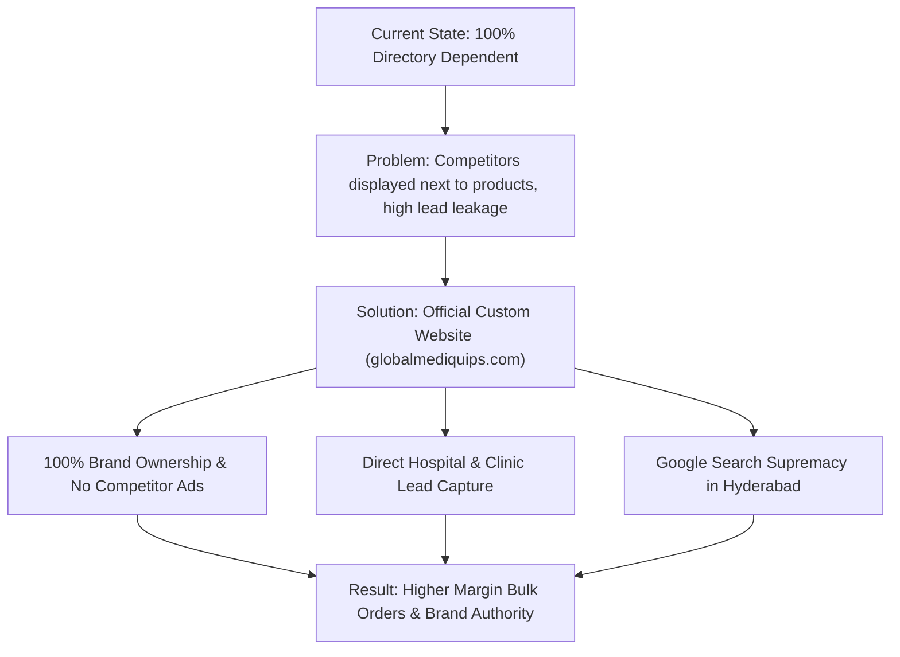

# 🚀 Web Design Agency Pitch & Strategy Proposal
## Client: Global Mediquips (Hyderabad, Telangana)
**Target Contact**: Mr. S. Katari (Proprietor / CEO)  
**Prepared by**: Web Design & Digital Development Agency  

---

## 🎯 Executive Summary: Why Global Mediquips Needs a Dedicated Website

Global Mediquips is a **₹2–5 Crore revenue business** operating successfully for over **10 years** in Amberpet, Hyderabad. However, they rely almost exclusively on third-party B2B directories like IndiaMART. 

While IndiaMART generates lead volume, it has 4 major business limitations:
1. **Competitor Ads & Distraction**: IndiaMART places rival medical suppliers' ads directly on Global Mediquips' product pages.
2. **Loss of High-Margin Direct B2B Orders**: Private hospitals, nursing homes, and diagnostic centers prefer buying directly from official corporate domains (`globalmediquips.com`).
3. **Price Wars & Commission Costs**: Directory listings force businesses into price competition rather than selling based on trust, quality, and service.
4. **Zero Local SEO Ownership**: They cannot build their own search equity on Google for key phrases like *"Medical equipment supplier Hyderabad"* or *"BiPAP machine rental Amberpet"*.

---

## 💡 Recommended Website Architecture & Feature Roadmap

### 1. Header & Navigation Structure
* **Brand Logo & GST Verification Badge** (Builds immediate trust with hospital procurement officers).
* **Direct Emergency Helpline / WhatsApp Button** (`+91-XXXXXXXXXX`).
* **Navigation**: Home | About Us | Product Catalog | B2B Bulk Quotes | Downloads (Brochures) | Contact & Location.

### 2. Digital Product Catalog with "Request Bulk Quote" Cart
* **Dynamic Category Showcase**:
  * Respiratory (BiPAP / CPAP / Oxygen Concentrators)
  * ICU & Hospital Furniture (Beds, Examination Tables, Syringe Pumps)
  * Diagnostic Care (12-Channel ECG, Spirometers, Defibrillators)
  * Surgicals & Homecare Essentials
* **Spec Sheets & PDF Downloads**: Direct download link for medical spec sheets (e.g. Philips DreamStation PDF brochure).
* **Quote Basket System**: Instead of consumer e-commerce checkout, allow buyers (hospitals/clinics) to add 5–10 items to a list and request a customized B2B quotation.

### 3. Local SEO Strategy for Hyderabad & Telangana
* Target High-Intent Keywords:
  * *"BiPAP Auto Machine price in Hyderabad"*
  * *"Oxygen concentrator wholesaler Amberpet"*
  * *"Hospital furniture manufacturer Telangana"*
  * *"Nidek ECG machine dealer Hyderabad"*
* **Google Business Profile Integration**: Embed map directions to Amberpet facility.

### 4. Interactive WhatsApp & Quick Lead Capture
* Float WhatsApp Chat widget: *"Need urgent Oxygen Concentrator or BiPAP machine in Hyderabad? Click to chat instantly."*

---

## 📊 Pitch Presentation Outline for Mr. S. Katari

---

## 📋 Client Engagement Action Plan

| Step | Action Item | Timeline |
| :---: | :--- | :---: |
| **1** | Share Preliminary Wireframe & Homepage Mockup | Day 1–2 |
| **2** | Pitch Call / In-person Meeting with Mr. S. Katari | Day 3 |
| **3** | Domain Registration (`globalmediquips.com`) & Setup | Day 4 |
| **4** | Product Catalog Ingestion (Import current 8 categories & products) | Day 5–7 |
| **5** | WhatsApp & Quote System Integration | Day 8–10 |
| **6** | Launch & Local SEO Indexing | Day 14 |
